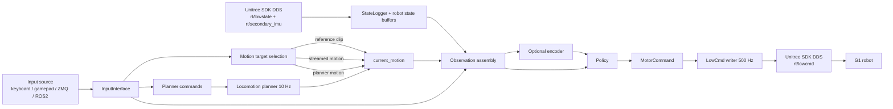

# G1 Deploy Design: Inference, Motion Tracking, Locomotion, and Unitree SDK Usage

## Scope

This document explains the current G1 deployment stack in this repository, with emphasis on:

- how inference is actually run today,
- how motion tracking and planner-based locomotion share the same runtime,
- how the deploy stack interacts with Unitree SDK2,
- what pieces are production-critical versus support code,
- how the final robot behavior is achieved end-to-end.

The primary runtime described here is:

- `gear_sonic_deploy/src/g1/g1_deploy_onnx_ref`

That is the current real deploy path for G1 in this repo.

There are also related but secondary paths:

- `decoupled_wbc/control/envs/g1/utils/*`: Python Unitree SDK helpers for low-level state/command access.
- `decoupled_wbc/sim2mujoco/*`: a lightweight MuJoCo-only ONNX evaluation path, useful for local experiments but not the main real-robot deployment runtime.

## Executive Summary

The current G1 deploy system is a low-level joint-control stack built around four layers:

1. Input layer: keyboard, Unitree wireless gamepad, ZMQ, ZMQ manager, or ROS2.
2. Motion target layer: either a preloaded reference motion, a streamed motion sequence, or a planner-generated locomotion sequence.
3. Inference layer: optional encoder -> control policy, both accelerated with TensorRT.
4. Robot I/O layer: Unitree SDK2 DDS subscriptions for robot state and DDS publication of low-level motor commands.

The most important design point is this:

- The runtime does not ask Unitree's high-level locomotion service to walk the robot.
- Instead, this repo generates full-body motion targets itself, then uses a learned policy to track those targets, and finally publishes low-level `LowCmd` joint commands directly to the robot.

So the locomotion "engine" is inside this repo:

- planner generates desired future motion,
- policy tracks that motion,
- Unitree SDK is the transport and low-level actuator/state interface.

## What Is Actually Used Today

### Production path

- Launcher and environment setup:
  - `gear_sonic_deploy/deploy.sh`
  - `gear_sonic_deploy/scripts/setup_env.sh`
- Main executable:
  - `gear_sonic_deploy/src/g1/g1_deploy_onnx_ref/src/g1_deploy_onnx_ref.cpp`
- Policy inference:
  - `gear_sonic_deploy/src/g1/g1_deploy_onnx_ref/include/control_policy.hpp`
- Optional encoder inference:
  - `gear_sonic_deploy/src/g1/g1_deploy_onnx_ref/include/encoder.hpp`
- Locomotion planner:
  - `gear_sonic_deploy/src/g1/g1_deploy_onnx_ref/include/localmotion_kplanner.hpp`
  - `gear_sonic_deploy/src/g1/g1_deploy_onnx_ref/include/localmotion_kplanner_tensorrt.hpp`
- Motion library and recording:
  - `gear_sonic_deploy/src/g1/g1_deploy_onnx_ref/include/motion_data_reader.hpp`
- Input interfaces:
  - `gear_sonic_deploy/src/g1/g1_deploy_onnx_ref/include/input_interface/*`
- Output interfaces:
  - `gear_sonic_deploy/src/g1/g1_deploy_onnx_ref/include/output_interface/*`
- G1 hardware constants and mappings:
  - `gear_sonic_deploy/src/g1/g1_deploy_onnx_ref/include/robot_parameters.hpp`
  - `gear_sonic_deploy/src/g1/g1_deploy_onnx_ref/include/policy_parameters.hpp`

### Unitree SDK pieces actually used by the production runtime

The main deploy runtime uses:

- `ChannelFactory`
- `ChannelPublisher<LowCmd_>`
- `ChannelSubscriber<LowState_>`
- `ChannelSubscriber<IMUState_>`
- `MotionSwitcherClient`
- Unitree gamepad data carried inside `LowState_.wireless_remote`
- DDS topics for Dex3 hands
- Unitree recurrent thread utilities via `CreateRecurrentThreadEx`

The runtime does not use:

- `g1_loco_client`
- high-level locomotion RPC as the main walking controller

That matters because it means the repo owns the locomotion and motion-tracking logic itself.

## High-Level Architecture



## The Three Runtime Behaviors

The stack supports three target-generation modes:

| Behavior | Source of target motion | Main use |
|---|---|---|
| Reference motion tracking | CSV clips loaded by `MotionDataReader` | offline playback, demos, validation |
| Streamed motion tracking | ZMQ-streamed motion or token data | teleoperation, external retargeting |
| Planner-based locomotion | planner ONNX -> generated `MotionSequence` | walking, running, squat, crawl, boxing, styled gaits |

All three end up feeding the same policy tracker.

That is the key unification:

- the policy does not care whether the target came from a prerecorded clip, a live ZMQ stream, or the locomotion planner,
- it always consumes observations built from current robot state plus target motion context and outputs low-level joint actions.

## Expected Models and Assets

The deploy stack expects the following model layout:

```text
gear_sonic_deploy/
├── policy/release/
│   ├── model_decoder.onnx
│   ├── model_encoder.onnx
│   └── observation_config.yaml
└── planner/target_vel/V2/
    └── planner_sonic.onnx
```

The roles are:

- `model_decoder.onnx`: main control policy, observations -> 29 joint actions.
- `model_encoder.onnx`: optional latent encoder, observations -> token state.
- `observation_config.yaml`: defines which observations the policy and encoder expect.
- `planner_sonic.onnx`: locomotion planner, recent context + high-level commands -> future full-body `qpos` sequence.

Reference motions are loaded from a directory such as:

- `reference/example/`

Each motion folder contains CSV data like:

- `joint_pos.csv`
- `joint_vel.csv`
- `body_pos.csv`
- `body_quat.csv`
- optional SMPL fields

## Build and Launch Flow

### Launcher

`gear_sonic_deploy/deploy.sh` is the operational entrypoint.

It does four things:

1. Resolves the target interface:
   - `sim` -> loopback
   - `real` -> auto-detect Unitree network, typically `192.168.123.x`
2. Resolves model/config/motion paths.
3. Sources `scripts/setup_env.sh` and builds.
4. Launches the deploy executable with the resolved arguments.

Typical command shape:

```bash
cd gear_sonic_deploy
./deploy.sh real
```

or:

```bash
cd gear_sonic_deploy
./deploy.sh --input-type zmq_manager sim
```

### Sim versus real

Simulation and real hardware use the same C++ deploy executable.

The main difference is:

- sim uses `--disable-crc-check`
- real keeps CRC validation enabled

That is important because the deploy stack is not a separate sim-only controller. It is the same controller connected either to:

- a simulator publishing Unitree-compatible state topics, or
- the real G1 over Unitree DDS.

## Main Executable Lifecycle

The main program is `g1_deploy_onnx_ref.cpp`.

At startup it:

1. Initializes Unitree DDS with `ChannelFactory::Instance()->Init(0, networkInterface)`.
2. Initializes Dex3 hands.
3. Uses `MotionSwitcherClient` to release any conflicting Unitree motion service.
4. Subscribes to:
   - `rt/lowstate`
   - `rt/secondary_imu`
5. Creates publisher for:
   - `rt/lowcmd`
6. Loads reference motions from disk.
7. Loads the policy TensorRT engine.
8. Loads observation config.
9. Optionally loads the encoder TensorRT engine.
10. Optionally loads the planner TensorRT engine.
11. Builds input and output interfaces.
12. Starts four recurrent threads.

### Thread model

The runtime uses four periodic threads:

| Thread | Rate | Responsibility |
|---|---:|---|
| Input | 100 Hz | poll active input interface and update control/planner states |
| Control | 50 Hz | gather observations, run encoder/policy, update hands, publish outputs |
| Planner | 10 Hz | generate or refresh planner motion |
| Command writer | 500 Hz | publish latest `LowCmd` motor command to the robot |

### State machine

The control thread uses:

- `INIT`
- `WAIT_FOR_CONTROL`
- `CONTROL`

Behavior:

- `INIT`: interpolate robot from current state to default standing angles.
- `WAIT_FOR_CONTROL`: hold ready state until operator start signal.
- `CONTROL`: run full inference and command pipeline every 20 ms.

## Unitree SDK Interaction Model

## Low-level DDS topics

The current production runtime uses the following Unitree topics:

| Topic | Direction | Purpose |
|---|---|---|
| `rt/lowstate` | subscribe | low-level robot state, joint states, IMU, gamepad bytes |
| `rt/secondary_imu` | subscribe | torso IMU |
| `rt/lowcmd` | publish | low-level joint command |
| `rt/dex3/left/cmd` | publish | left hand command |
| `rt/dex3/right/cmd` | publish | right hand command |
| `rt/dex3/left/state` | subscribe | left hand state |
| `rt/dex3/right/state` | subscribe | right hand state |

### Motion switcher

Before taking over low-level control, the code uses `MotionSwitcherClient` to release any active high-level motion service.

Why this is necessary:

- if Unitree's own motion service is still active, it can fight the repo's low-level `LowCmd` controller,
- the deploy runtime wants exclusive ownership of joint-level commands.

### Gamepad handling

The current runtime does not talk to a separate gamepad device through a separate API.

Instead:

- gamepad data arrives embedded in `LowState_.wireless_remote`,
- the input thread copies those 40 bytes into the active gamepad interface.

So the gamepad is effectively another sensor field inside the Unitree state stream.

### Command publishing

The command writer thread converts the latest internal `MotorCommand` into a Unitree `LowCmd_` packet:

- `mode_pr` and `mode_machine` are set,
- each of 29 motors gets `q`, `dq`, `kp`, `kd`, `tau`,
- CRC is computed,
- the message is written to `rt/lowcmd`.

This happens at 500 Hz.

## Inference Stack

## Policy

The policy wrapper in `control_policy.hpp`:

- loads ONNX,
- converts ONNX -> TensorRT engine,
- caches the converted TRT engine on disk,
- validates a single input tensor named `obs_dict`,
- validates a single output tensor named `action`,
- runs inference on GPU,
- optionally replays a captured CUDA graph for lower latency and more deterministic execution.

The policy output is always:

- 29 joint actions

These actions are not directly torques.

They are converted into joint position targets using:

- `g1_action_scale`
- `default_angles`
- per-joint `kp`/`kd`

So the policy is fundamentally producing a learned target-tracking command that is then wrapped in a PD-style low-level command.

### Encoder

The encoder wrapper in `encoder.hpp` is similar:

- input tensor: `obs_dict`
- output tensor: `encoded_tokens`

Its role is to compress a richer observation set into a `token_state` vector.

That token can then be used by the policy as one observation block.

The encoder is optional. The repo supports three token sources:

1. no token state at all,
2. local encoder-generated tokens,
3. externally streamed tokens from ZMQ or ROS2.

### Observation config

`observation_config.yaml` is a critical piece of the runtime.

It determines:

- which policy observations are enabled,
- their runtime order,
- encoder token dimension,
- which encoder observations are enabled,
- mode-specific encoder observation subsets.

At startup the runtime validates:

- enabled observation dimensions exactly match the policy model input dimension,
- enabled encoder observation dimensions exactly match the encoder model input dimension.

This is one of the main reasons the runtime is robust to multiple policy variants.

## How Observations Are Built

The control loop gathers observations from three places:

1. current robot state from `StateLogger`,
2. current target motion from `current_motion_` and `current_frame_`,
3. current input-layer auxiliary data:
   - VR 3-point
   - VR 5-point
   - upper-body joints
   - hand joints
   - external tokens

Examples of observation families:

- motion target joint positions and velocities,
- target root orientation and height,
- robot joint position/velocity history,
- last action history,
- base angular velocity,
- gravity direction,
- SMPL target features,
- VR target features,
- token state.

The observation registry in `g1_deploy_onnx_ref.cpp` is the single source of truth for observation names, dimensions, and gather functions.

## Motion Tracking Path

## 1. Reference motion tracking

Reference motions are loaded once by `MotionDataReader`.

The default runtime behavior is:

- choose one loaded motion as `current_motion_`,
- keep `current_frame_`,
- on play, advance through the motion at 50 Hz,
- each control tick builds policy observations relative to the target frame,
- the policy tracks the target.

This is the simplest and most direct path.

It is used for:

- playback of prerecorded demonstrations,
- validating the policy against a motion library,
- keyboard and gamepad reference-mode demos.

## 2. Streamed motion tracking over ZMQ

`ZMQEndpointInterface` handles live motion streaming.

It supports:

- Protocol v1: joint-based streaming
- Protocol v2: SMPL-based streaming
- Protocol v3: joint + SMPL streaming
- Protocol v4: token-only streaming

### Motion protocols v1-v3

For v1-v3:

- incoming messages carry frame indices and pose data,
- `StreamedMotionMerger` aligns them onto a sliding window,
- late data can trigger a catch-up reset,
- the merged result becomes a `MotionSequence` named `streamed`,
- the control loop tracks it exactly like a prerecorded clip.

This is how live full-body teleoperation or external retargeting becomes a target for the learned controller.

### Token-only protocol v4

Protocol v4 bypasses motion decoding.

Instead:

- the runtime receives a token vector directly,
- stores it into `token_state_data_`,
- disables local encoder use for that tick,
- lets the policy consume those tokens directly.

This is useful when an upstream system already computed the correct latent representation.

### Why motion tracking works

The runtime turns incoming motion into the same abstraction as prerecorded clips:

- a `MotionSequence`
- plus a current frame cursor

That design makes tracking robust because all downstream logic remains identical:

- same heading logic,
- same observation builders,
- same policy,
- same low-level command writer.

## Locomotion Path

The planner path is what makes real-time walking and locomotion possible.

## Planner inputs

The planner consumes a `MovementState`:

- `locomotion_mode`
- `movement_direction`
- `facing_direction`
- `movement_speed`
- `height`

These are produced by input interfaces:

- keyboard planner controls,
- gamepad planner controls,
- `zmq_manager` planner topic,
- optionally ROS2 input.

## Planner model contract

The planner model takes recent motion context plus high-level commands and returns:

- a future sequence of full-body MuJoCo `qpos` frames,
- number of valid predicted frames

Practically:

- input is a short history of full-body pose,
- output is a short horizon future motion clip.

The planner does not directly command motors.

It generates the target motion that the policy will then track.

## Planner update logic

Planner thread behavior:

1. If planner was just enabled, initialize it from the robot's current quaternion and joint positions.
2. Build planner context from recent motion.
3. Decide whether replanning is needed based on:
   - locomotion mode change,
   - movement direction change,
   - facing direction change,
   - speed/height change,
   - periodic replan interval.
4. Run planner TensorRT inference.
5. Resample planner output from 30 Hz to 50 Hz.
6. Mark new planner motion available.

Replan interval is mode-dependent:

- run: fast replanning
- crawl: medium replanning
- boxing/static styles: slower replanning

## Planner output integration

The control thread does not abruptly replace the old planner motion.

Instead it:

- checks if a new planner motion is available,
- blends the new trajectory into the old one over a short horizon,
- rewrites `planner_motion_`,
- switches `current_motion_` to `planner_motion_`,
- keeps advancing frames at 50 Hz.

This blending step is a major reason locomotion looks smooth rather than jerky.

## How Motion Tracking and Locomotion Meet

The planner is not a separate controller. It is a target generator.

The unified pattern is:

- reference clip -> target motion
- streamed clip -> target motion
- planner output -> target motion

Then in all cases:

- target motion + robot state -> policy observations
- policy -> low-level joint command

That is the central architectural idea of the repo.

## Control Loop: Exact End-to-End Flow

Each 50 Hz control tick does this:

1. Read latest `LowState` and torso IMU.
2. Validate safety:
   - state freshness,
   - CRC when enabled,
   - joint velocity sanity,
   - motor error transitions.
3. Log current robot state into `StateLogger`.
4. Snapshot input-layer data:
   - VR points,
   - hand joints,
   - upper-body overrides,
   - external tokens,
   - streaming freshness.
5. Update heading state if needed.
6. Build observation vector from:
   - robot history,
   - current motion target,
   - live interface data.
7. If using local encoder:
   - gather encoder observations,
   - run encoder,
   - update `token_state`.
8. Run policy inference.
9. Convert policy output into `MotorCommand`:
   - scale action,
   - add default angles,
   - assign `kp`/`kd`,
   - zero feedforward torque.
10. Update Dex3 hand targets.
11. Publish debug output over ZMQ and/or ROS2.
12. Optionally record streamed/planner motion.
13. Advance current frame and blend planner motion if needed.

## How Actions Become Robot Motion

Policy output becomes motion through four conversions:

1. Policy action is in learned action space.
2. Action is scaled by `g1_action_scale`.
3. Scaled action is added to `default_angles` to form joint targets.
4. `kp` and `kd` turn that into a low-level position/velocity command for each motor.

So the final robot motion is achieved by:

- learned target-tracking,
- wrapped in deterministic per-joint PD gains,
- sent out at 500 Hz over Unitree low-level DDS.

That combination is why the stack can remain reactive while still respecting hardware control structure.

## Safety and Reliability Logic

Several safety layers are built into the runtime:

- CRC validation of `LowState` on real robot.
- `MotionSwitcherClient` release before low-level control starts.
- stale `LowState` timeout check.
- planner timeout handling in `zmq_manager`.
- damping command on stop.
- temperature warnings and TTS.
- emergency stop from keyboard/gamepad/ZMQ manager.
- protocol-version consistency checks for streamed motion.
- catch-up reset for large streaming gaps.

This is important because the system is intentionally low-level. It therefore includes its own guards rather than relying on Unitree high-level locomotion safety behavior.

## Output and Debugging

The runtime can publish outputs through:

- ZMQ
- ROS2
- or both

The ZMQ output handler publishes:

- current robot state,
- current target state,
- last actions,
- tokens,
- hand states,
- VR points,
- robot config

Main use cases:

- online visualization,
- debugging observation drift,
- validating target versus measured motion,
- downstream logging.

## What Finally Produces the Good Results

The observed motion quality comes from the combination of several layers, not any single model:

### 1. Good target generation

- prerecorded motions give clean references,
- streamed motion provides live teleop targets,
- planner produces short-horizon locomotion trajectories.

### 2. Shared target abstraction

Everything becomes a `MotionSequence`, so the controller tracks one consistent target format.

### 3. Policy conditioning

The policy does not only see the robot's current state.

It also sees:

- future motion targets,
- robot state history,
- prior actions,
- optional token embeddings,
- optional teleop/VR features.

That gives it the context needed to track dynamic motions instead of just static poses.

### 4. Deterministic low-level execution

- 50 Hz control inference,
- 500 Hz command publication,
- fixed `kp`/`kd`,
- stable joint remapping and default offsets.

### 5. Planner-policy split

The planner handles high-level motion synthesis.
The policy handles low-level whole-body tracking.

That separation is why the system can both:

- generate locomotion online,
- and still execute it with a joint-level learned controller.

## How To Leverage Unitree SDK in This Repo

## Recommended rule

Use Unitree SDK differently depending on the layer:

- use C++ `unitree_sdk2` for production real-time deployment,
- use Python `unitree_sdk2py` for tooling, debugging, lightweight experiments, and support scripts.

## C++ usage pattern in the production stack

Use the same pattern as `g1_deploy_onnx_ref.cpp`:

```cpp
ChannelFactory::Instance()->Init(0, networkInterface);

ChannelPublisher<LowCmd_> lowcmd_pub(HG_CMD_TOPIC);
lowcmd_pub.InitChannel();

ChannelSubscriber<LowState_> lowstate_sub(HG_STATE_TOPIC);
lowstate_sub.InitChannel(callback, 1);

ChannelSubscriber<IMUState_> torso_imu_sub(HG_IMU_TORSO);
torso_imu_sub.InitChannel(callback, 1);

unitree::robot::b2::MotionSwitcherClient msc;
msc.Init();
```

Use this path when you need:

- hard real-time-ish loops,
- the exact same DDS contract as the production runtime,
- low jitter command publication,
- direct integration with the current C++ deploy stack.

## Python usage pattern in this repo

The existing Python examples are:

- `decoupled_wbc/control/envs/g1/utils/command_sender.py`
- `decoupled_wbc/control/envs/g1/utils/state_processor.py`

They show the typical `unitree_sdk2py` pattern:

```python
from unitree_sdk2py.core.channel import ChannelPublisher, ChannelSubscriber
from unitree_sdk2py.comm.motion_switcher.motion_switcher_client import MotionSwitcherClient
```

What they are useful for:

- reading `LowState`,
- reading torso IMU and hand states,
- publishing `LowCmd`,
- publishing Dex3 hand commands,
- quickly scripting tests without touching the C++ runtime.

Use Python for:

- diagnostics,
- data capture,
- quick actuator/state tests,
- prototypes,
- sim bridges.

Do not treat the Python helpers as the primary production locomotion runtime here.

## Practical Unitree SDK guidelines

If you want to extend this repo, the most useful Unitree SDK patterns are:

### Read robot state

Use:

- `rt/lowstate`
- `rt/secondary_imu`
- optional Dex3 hand state topics

Do this when adding:

- new observations,
- thermal monitoring,
- debugging tools,
- estimators.

### Send low-level body commands

Use:

- `rt/lowcmd`

Requirements:

- release conflicting motion service first,
- compute CRC correctly,
- keep joint order straight,
- keep publish cadence high and stable.

### Send hand commands

Use:

- `rt/dex3/left/cmd`
- `rt/dex3/right/cmd`

The repo already provides a good wrapper in `dex3_hands.hpp`.

### Read gamepad input

Do not build a separate transport unless you must.

The current system already reads the Unitree wireless controller through:

- `LowState_.wireless_remote`

That is the simplest and most consistent path inside this repo.

### What not to do

Avoid mixing:

- Unitree high-level locomotion service
- this repo's low-level `LowCmd` controller

at the same time.

The current design assumes the repo has low-level authority.

## Extension Points

If you want to change behavior, these are the main leverage points:

### Add or change policy observations

Edit:

- `observation_config.yaml`
- observation registry and gatherers in `g1_deploy_onnx_ref.cpp`

Use this for:

- new sensors,
- new teleop features,
- different history windows,
- new encoder modes.

### Change locomotion behaviors

Edit:

- planner model
- `localmotion_kplanner.hpp`
- planner input handlers in keyboard/gamepad/ZMQ manager

Use this for:

- new locomotion modes,
- new replan logic,
- different speed or height semantics,
- waypoint control.

### Change streamed teleop behavior

Edit:

- `input_interface/zmq_endpoint_interface.hpp`
- `input_interface/streamed_motion_merger.hpp`
- `input_interface/zmq_manager.hpp`

Use this for:

- new ZMQ message fields,
- different streaming protocols,
- token-only interfaces,
- new upper-body/hand streaming logic.

### Change hardware actuation behavior

Edit:

- `policy_parameters.hpp`
- `robot_parameters.hpp`
- `CreatePolicyCommand()` and `LowCommandWriter()`

Use this for:

- different gains,
- different action scaling,
- different default pose,
- different command shaping.

## Secondary Path: Python/MuJoCo ONNX Eval

There is also a simpler path in:

- `decoupled_wbc/sim2mujoco/scripts/run_mujoco_gear_wbc.py`
- `decoupled_wbc/sim2mujoco/scripts/run_mujoco_gear_wbc_gait.py`

This path:

- runs ONNXRuntime directly in Python,
- builds observations manually,
- uses MuJoCo for simulation,
- applies PD torques locally.

That path is useful for:

- local policy experiments,
- fast simulator-side debugging,
- simpler ONNX checks.

But it is not the main deploy architecture for the real G1 runtime described above.

## Bottom Line

The current G1 deployment pipeline in this repo is:

1. get robot state through Unitree SDK DDS,
2. choose or generate a target motion,
3. build policy observations from robot history plus target context,
4. optionally encode observations into tokens,
5. run policy inference on GPU,
6. convert actions into low-level joint targets,
7. publish `LowCmd` through Unitree SDK,
8. repeat continuously with planner and input interfaces updating the target.

The Unitree SDK is therefore used as the low-level robot transport and device interface, while the repo itself owns:

- locomotion generation,
- motion tracking,
- observation building,
- neural inference,
- joint-level control logic.

That is the current design.
